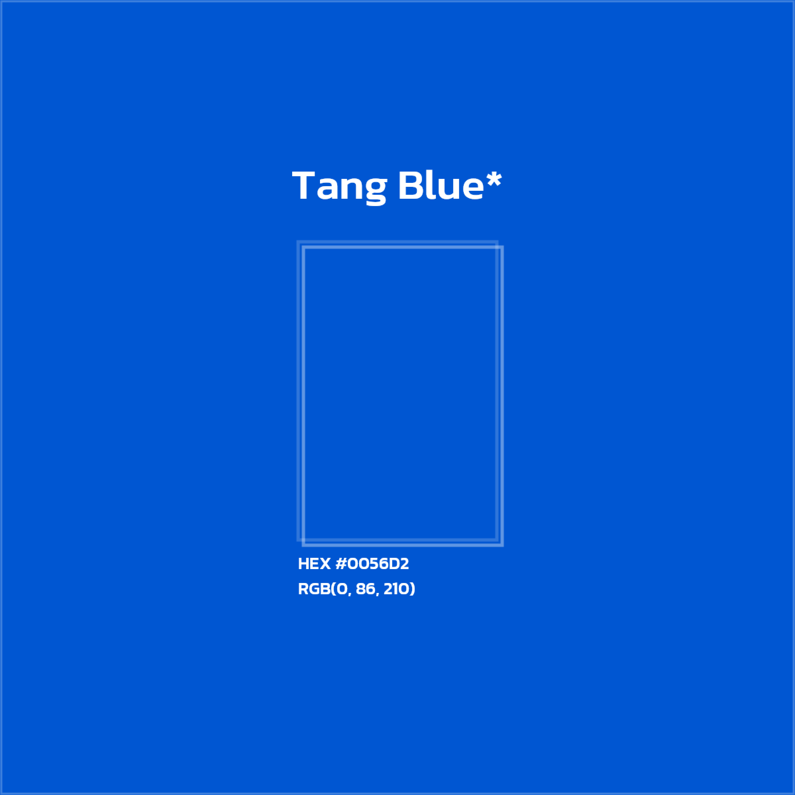

# Brand Assets

### Our Logo

Feel free to use our logo in color, black or white.

<figure><figcaption>
Color - Tang Blue
</figcaption></figure>

<figure><figcaption>
White - Alice Blue
</figcaption></figure>

<figure><figcaption>
Black
</figcaption></figure>

### Symbol

Use these only when the Discord brand is clearly visible or has been well established elsewhere.

<figure><figcaption>
Color - Tang Blue
</figcaption></figure>

<figure><figcaption>
White - Alice Blue
</figcaption></figure>

<figure><figcaption>
Black
</figcaption></figure>

### Colors

Tang Blue looks good in every season.

<figure><figcaption>
Tang Blue
</figcaption></figure> <figure><figcaption>
Black
</figcaption></figure>

<figure><figcaption>
Alice Blue
</figcaption></figure>

