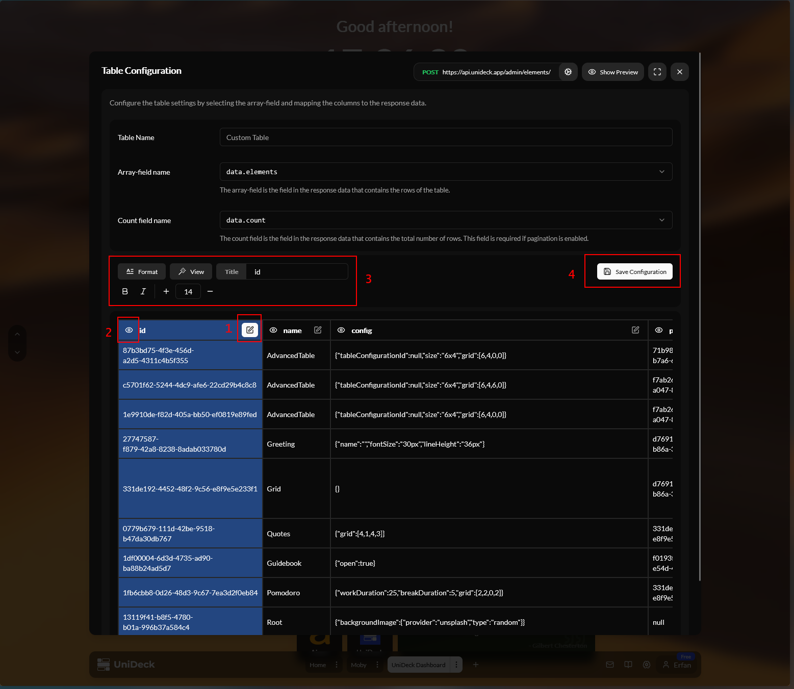

# Advanced - Table

The **Advanced Table** widget is a powerful tool that allows you to create tables with custom data sources, enabling you to display and manage information in a structured format. This widget is particularly useful for users who need to monitor multiple data points or track specific metrics across various categories.

#### Widget Sizes

To accommodate different user preferences and dashboard layouts, the Advanced Table widget is available in many sizes.

<table data-card-size="large" data-view="cards" data-full-width="true"><thead><tr><th align="center"></th><th data-hidden data-card-cover data-type="files"></th></tr></thead><tbody><tr><td align="center"><strong>6 x 4</strong></td><td><a href="../../.gitbook/assets/AdvancedTable-6x4.png">AdvancedTable-6x4.png</a></td></tr><tr><td align="center"><strong>8 x 4</strong></td><td><a href="../../.gitbook/assets/AdvancedTable-8x4.png">AdvancedTable-8x4.png</a></td></tr><tr><td align="center"><strong>8 x 6</strong></td><td><a href="../../.gitbook/assets/AdvancedTable-8x6.png">AdvancedTable-8x6.png</a></td></tr><tr><td align="center"><strong>12 x 4</strong></td><td><a href="../../.gitbook/assets/AdvancedTable-12x4.png">AdvancedTable-12x4.png</a></td></tr><tr><td align="center"><strong>12 x 6</strong></td><td><a href="../../.gitbook/assets/AdvancedTable-12x6.png">AdvancedTable-12x6.png</a></td></tr><tr><td align="center"><strong>12 x 8</strong></td><td><a href="../../.gitbook/assets/AdvancedTable-12x8.png">AdvancedTable-12x8.png</a></td></tr></tbody></table>

#### Functionality

The Advanced Table widget provides a range of functionalities to enhance your data management experience:

* **Pagination**: Easily navigate through large datasets with pagination controls, allowing you to view a specific number of entries at a time.
* **Sorting**: Sort data by any column to quickly find the information you need.
* **Column Visibility**: Customize the visibility of columns to focus on the most relevant data points.
* **Filtering**: Apply filters to narrow down the displayed data based on specific criteria, making it easier to find relevant information.
* **HTTP/API Data Source**: Connect to external data sources via HTTP/S, enabling you to pull in real-time data from various platforms.
* **API Hub**: Utilize the API Hub to access a wide range of APIs, allowing you to centralize, share, and manage your data sources effectively.

#### Column and Table Editor

<figure><figcaption></figcaption></figure>

The Advanced Table widget includes a built-in column and table editor, familiar to what you're used to from Microsoft Excel or Google Sheets. This editor allows you to easily manipulate the data within the table, including:

* **Adding/Removing Columns**: Quickly add or remove columns to customize the table structure.
* **Editing Cell Values**: Click on any cell to edit its value directly, making it easy to update information on the fly.
* **Visual Formatting**: Apply visual formatting to cells, such as changing colors or styles, to highlight important data points.
* **Data Validation**: Set up data validation rules to ensure that only valid data is entered into the table, reducing errors and improving data integrity.
* **Array and Object Support**: The table supports both array and object data types, allowing you to work with complex datasets seamlessly.

#### Configuration and Context Menu

To set up and customize the Advanced Table widget, follow these steps:

* **Configuration**: To set up the widget:
  * **Accessing Configuration**: Right-click on the widget to open the context menu and select the "Configure" option.
  * **Selecting API Request**: Choose the API request you want to use as the data source for your table.
  * **Specifying field names**: Pick a `array` field name to be used as the table header.
  * **Setting up Pagination**: Pick a `count` field name to be used as the pagination count. Required for pagination only.
* **Context Menu**: Right-clicking on the widget provides options to:
  * **Adjust Size**: Switch between different sizes to fit your dashboard layout.
  * **Configure Widget**: Access the configuration modal to update the data source and table settings.
