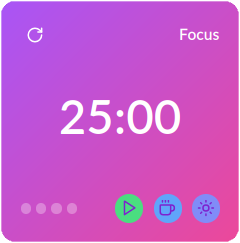

# Pomodoro

The **Pomodoro Widget** in UniDeck is a powerful tool designed to enhance your productivity by implementing the Pomodoro Technique—a time management method that alternates focused work sessions with short breaks. This widget helps you maintain concentration and prevent burnout, making it ideal for tasks such as studying, working, or any activity that benefits from structured time intervals.

### Widget Size

To provide an optimal balance between functionality and space utilization, the Pomodoro Widget is available exclusively in a **Medium** size, ensuring clear visibility and ease of interaction on your dashboard.

<figure><figcaption>
Pomodoro Widget
</figcaption></figure>

### Using the Pomodoro Widget

The Pomodoro Widget offers an intuitive interface with the following features:

* **Focus and Break Timers**: Easily switch between work and break periods using the designated buttons:
  * **Coffee Cup Button**: Initiates the Break timer, allowing you to take short rests.
  * **Sunshine Button**: Starts the Focus timer for concentrated work sessions.
* **Session Control**: Manage your sessions effectively with the following controls:
  * **Play Button**: Begins the selected timer (Focus or Break).
  * **Refresh Button**: Located at the top-left corner, this button resets the current session, enabling you to restart the timer as needed.

### Customization Options

Tailor the Pomodoro Widget to fit your personal workflow preferences by accessing the configuration modal through the right-click context menu. The following settings are available for customization:

* **Pomodoro Count**: Select the number of focus sessions before a long rest, with preset options of 4, 6, 8, or define a custom count.
* **Focus Duration**: Set the length of each focus session, choosing from 25, 50, 60 minutes, or specify a custom duration.
* **Break Duration**: Determine the length of short breaks between focus sessions, with options of 5, 10, 15 minutes, or enter a custom time.
* **Long Rest Duration**: Configure the duration of the extended break after completing a set of focus sessions, selecting from 15, 20, 30 minutes, or input a custom period.
* **Auto-Start Options**: Enhance workflow automation by enabling or disabling automatic start for:
  * **Focus Sessions**
  * **Breaks**
  * **Long Rests**

By integrating the Pomodoro Widget into your UniDeck dashboard, you can effectively manage your time, maintain high levels of productivity, and ensure a balanced work-rest routine tailored to your individual needs.
