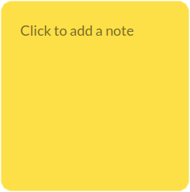

# Sticky Note

The **Sticky Note Widget** in UniDeck offers a simple and effective way to jot down and display your thoughts, ideas, reminders, or any information you wish to keep visible on your dashboard. Serving as a digital equivalent of traditional sticky notes, this widget ensures that important notes are always within your sight.

### Widget Size

To maintain a clean and organized dashboard, the Sticky Note Widget is available exclusively in a **Medium** size, providing ample space for your notes without overwhelming your workspace.

<figure><figcaption>
Sticky Note Widget
</figcaption></figure>

### Functionality

Designed for straightforward use, the Sticky Note Widget allows you to:

* **Add Notes**: Click on the widget to type and save your notes directly.
* **Edit Notes**: Update your existing notes with ease by clicking on the text area.

### Customization Options

While the Sticky Note Widget is minimalist by design, it offers customization to enhance visibility and personal preference:

* **Background Color**: Right-click on the widget to access the context menu, where you can select from a palette of colors to differentiate or prioritize your notes visually.

By incorporating the Sticky Note Widget into your UniDeck dashboard, you can keep essential information readily accessible, aiding in organization and productivity.
