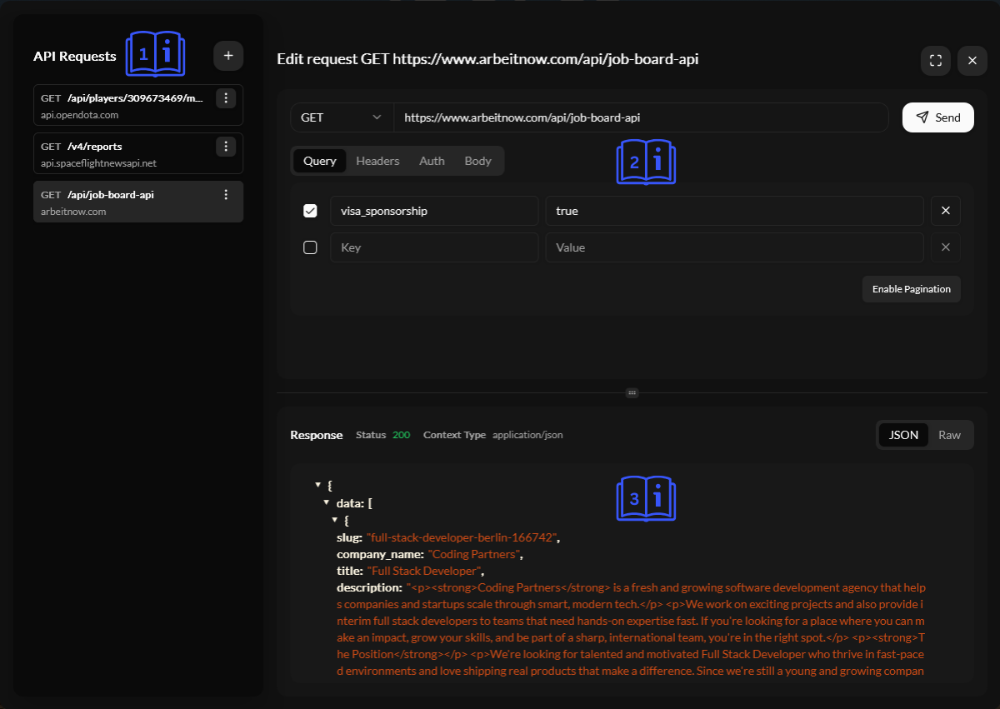

# API Hub

One of the main goals of creating UniDeck was to provide a way to easily integrate your custom data and have an easy to use and customize dashboard unlike the existing solutions. The API Hub is the core of this functionality. It allows you to connect to any HTTP API and use the data in your dashboards.

You probably have previously used similar tools like Postman, Insomnia or even cURL to test and share your APIs. The API Hub is similar to these tools, but it is designed to be used with-in UniDeck and be easy to shared with your team. It is also designed to be used with-in the context of a dashboard, so you can easily visualize the data you are working with.

### How we call your APIs?

API requests done through API Hub are routed through your own browser and internet and are NOT ever sent to UniDeck's servers.


This can be verified by yourself with checking your browser console if you're a tech savvy!


### API Hub Overview

The API Hub's interface is designed to be simple and easy to use. It consists of a few main sections:

1. **API Requests**: This is where you can create and manage your API requests. You can create new requests, edit existing ones, and delete or duplicate requests.
2. **Create new request - Edit request**: This is where you can create a new request or edit an existing one after selecting it on **API Reqeuests**. You can specify the request method (GET, POST, PUT, DELETE), the URL, any headers, authentication method, body or query parameters you want to include in the request.
3. **Response**: This is where you can see the response from the API request. You can view the response body and status code. You can also see any errors that occurred during the request.

<figure><figcaption></figcaption></figure>

### Request Editor

The request editor is where you can create and edit your API requests. It consists of a few main sections:

1. **Request Method**: This is where you can select the HTTP method for your request. You can choose from GET, POST, PUT, DELETE, PATCH, OPTIONS and HEAD.
2. **URL**: This is where you can enter the URL for your request. This URL needs to be accessible on the internet or on your local network serving UniDeck Enterprise.
3. **Query Parameters**: This is where you can add any query parameters you want to include in the request. You can add as many query parameters as you need. The query parameters will be automatically encoded for you.
4. **Pagination**: If your API supports pagination, you can click on "Enable Pagination" to automatically add pagination parameters to your request. This will only work if your API supports pagination via `page` and `per_page` query parameters.
5. **Headers**: This is where you can add any headers you want to include in the request. You can add as many headers as you need. The headers will be automatically encoded for you.
6. **Auth**: This is where you can select the authentication method for your request. You can choose from None, Basic Auth and Bearer Token.
7. **Basic Auth**: This is where you can enter the username and password for basic authentication. The username and password will be automatically encoded for you.
8. **Bearer Token**: This is where you can enter the bearer token for authentication. You can also customize the prefix for the token. The token will be automatically encoded for you if needed.
9. **Body**: This is where you can enter the body for your request. You can only send text based body types like `application/json`, `application/x-www-form-urlencoded`, `text/plain`, `text/html` and `application/xml`. The content-type needs to be manually set in the headers. The body will be automatically encoded for you if needed.

### Response Viewer

The Response Viewer in UniDeck's API Hub allows you to inspect API responses in detail. It displays the status code, headers, and body of the response, enabling you to understand the data returned by your API calls.​

#### Features

* **Status Code Display**: Clearly indicates the HTTP status code returned by the API.​
* **Headers Inspection**: Shows important headers like \`content-type\`, providing insight into metadata sent by the server.​
* **Body Preview**: Presents the response body in a formatted and readable manner, supporting various content types such as JSON, XML, and plain text.​

<table data-card-size="large" data-view="cards"><thead><tr><th></th><th data-hidden data-card-cover data-type="files"></th></tr></thead><tbody><tr><td>Successful Response View</td><td><a href="../../../.gitbook/assets/Screenshot 2025-04-07 185235.png">Screenshot 2025-04-07 185235.png</a></td></tr><tr><td>Error Response View</td><td><a href="../../../.gitbook/assets/Screenshot 2025-04-07 185214.png">Screenshot 2025-04-07 185214.png</a></td></tr></tbody></table>

### Troubleshooting Errors

When an API call results in an error, UniDeck's troubleshooting view assists in diagnosing and resolving the issue.​

#### Error Details

* **Error Messages**: Displays the error message returned by the API, offering initial insight into the problem.​
* **Stack Trace**: If available, provides a stack trace to help pinpoint where the error occurred.​
* **Suggested Solutions**: Offers recommendations or links to relevant documentation to aid in resolving the error.​

For comprehensive guidance on handling specific error codes and messages, refer to the Troubleshooting Guide.​


[troubleshooting-guide.md](troubleshooting-guide.md)


