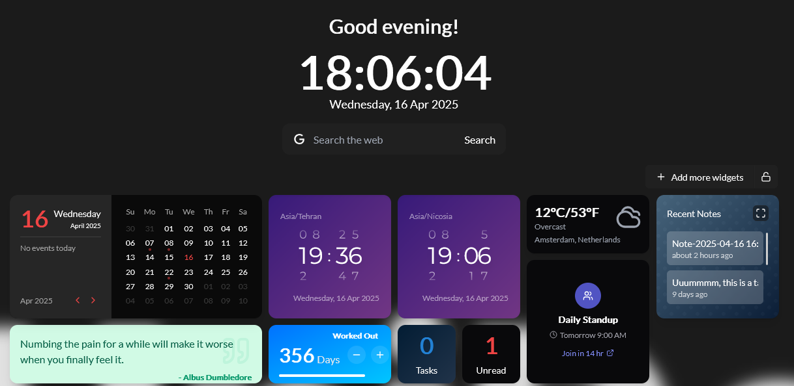

# How to Use Profiles on UniDeck

UniDeck's **Profiles** feature empowers you to create personalized dashboards tailored to various aspects of your life, such as Home, Work, Gaming, or any custom category. This guide will walk you through setting up and managing profiles to enhance your UniDeck experience.

### Creating a Profile

UniDeck offers two methods to create a new profile: during your initial setup or anytime via the User Toolbar.

#### Initial Setup

Upon your first login:

1. **Welcome Prompt**: A pop-up will appear, inviting you to create your first profile.
2. **Profile Selection**: Choose from predefined options like Home, Work, Gaming, Fun, or select "Custom" to define your own.
3. **Finalize**: Click "Create Profile" to establish your personalized dashboard space.

<figure><figcaption></figcaption></figure>

#### Using the User Toolbar

To create additional profiles:

1. **Access the User Toolbar**: Located at the bottom of your UniDeck dashboard.
2. **Add a New Profile**: Click the "+" button next to your current profile name.
3. **Assign a Name**: Enter a unique name for the new profile.
4. **Finalize**: Click "Create Profile" to add the new profile to your dashboard.

<figure><figcaption></figcaption></figure>

### Managing Profiles

UniDeck provides flexible options for handling multiple profiles:

* **Switching Between Profiles**:
  * Click on your current profile name in the User Toolbar.
* **Deleting Profiles**:
  1. **Access the User Toolbar**: Navigate to the bottom of your dashboard.
  2. **Select Profile**: Right-click on the profile you wish to delete.
  3. **Delete Profile**: Choose "Delete" from the context menu.
  4. **Confirm Deletion**: A prompt will appear; click "Yes" to confirm.

### Profile Features

Each profile in UniDeck operates as a distinct workspace:

* **Unique Widget Sets**: Profiles maintain their own collection of widgets, allowing you to organize tools and information specific to each context.
* **Customized Layouts**: Tailor the arrangement and appearance of widgets within each profile to suit your preferences and needs.

### Team Collaboration with Profiles

For users on the **Team Plan**, UniDeck enhances collaborative efforts:

* **Profile Sharing**: Share specific profiles with team members to ensure everyone has access to the same tools and information.
* **Real-Time Collaboration**: Collaborate simultaneously within shared profiles, with changes reflecting instantly for all members.
* **Permission Settings**: Control access levels by assigning roles, determining who can view or modify shared profiles.

By effectively utilizing profiles, UniDeck enables you to compartmentalize different areas of your life or work, providing a streamlined and organized dashboard experience tailored to your diverse needs.
