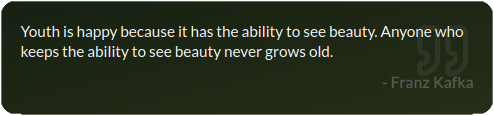

# Quote

The **Quote Widget** in UniDeck brings daily inspiration and motivation directly to your dashboard, offering a fresh quote each day to uplift and energize you.

### Widget Size

To provide an optimal display of each quote, the Quote Widget is available exclusively in a **Long** size, ensuring ample space for the text to be presented clearly and elegantly.

<figure><figcaption></figcaption></figure>

### Functionality

Designed for simplicity and ease of use, the Quote Widget operates autonomously:

* **Daily Updates**: Automatically refreshes to showcase a new inspirational or motivational quote each day, keeping your dashboard content dynamic and engaging.

### Customization Options

The Quote Widget is crafted to deliver a seamless experience without the need for manual adjustments:

* **Configuration Settings**: There are no specific configuration options required; the widget functions independently to provide daily quotes.
* **Context Menu**: Right-clicking on the widget does not reveal additional settings, as the widget is designed for straightforward, out-of-the-box use. But you can delete the widget via the Right-Click menu.

By incorporating the Quote Widget into your UniDeck dashboard, you infuse your workspace with daily doses of inspiration, fostering a positive and motivating environment to enhance your productivity and well-being.
