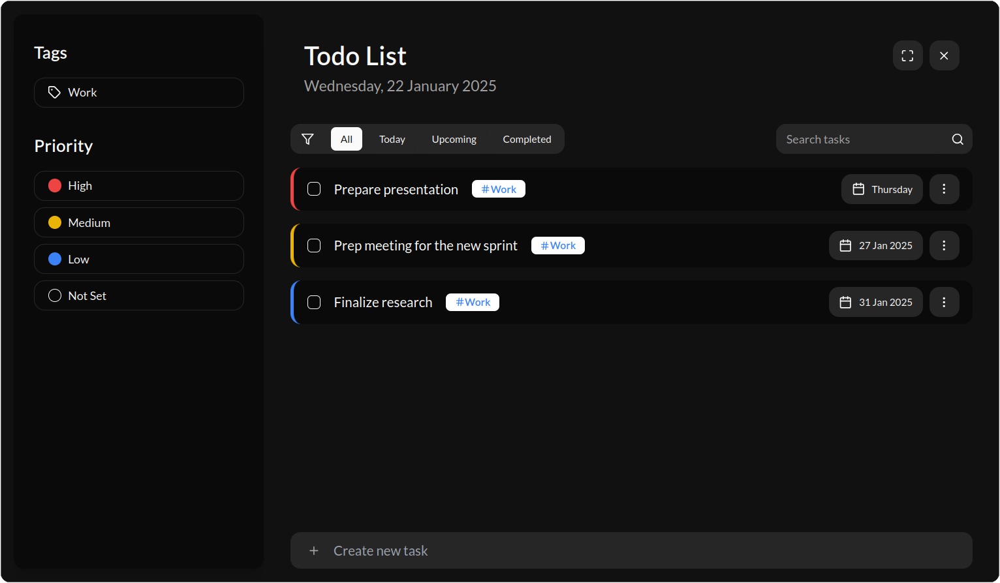

# Todo List

The **Todo List Widget** in UniDeck is a robust tool designed to help you efficiently manage your tasks, chores, and projects directly from your dashboard. With its intuitive interface and comprehensive features, it ensures that you stay organized and on top of your responsibilities.

### Widget Sizes

To cater to diverse user preferences and dashboard configurations, the Todo List Widget is available in the following sizes:

* **Extra Small**: Ideal for minimalistic displays, showing a concise list of tasks.
* **Medium**: Offers a balanced view, providing more task details without occupying excessive space.
* **Large**: Perfect for users who prefer a comprehensive overview of their tasks, displaying extensive information at a glance.

<table data-card-size="large" data-view="cards" data-full-width="true"><thead><tr><th align="center"></th><th data-hidden data-card-cover data-type="files"></th></tr></thead><tbody><tr><td align="center">Small</td><td><a href="../../.gitbook/assets/TodoList-1x1.png">TodoList-1x1.png</a></td></tr><tr><td align="center">Medium</td><td><a href="../../.gitbook/assets/TodoList-3x3.png">TodoList-3x3.png</a></td></tr><tr><td align="center">Large</td><td><a href="../../.gitbook/assets/TodoList-4x4.png">TodoList-4x4.png</a></td></tr></tbody></table>

### Functionality

The Todo List Widget is designed to streamline your task management process:

* **Task Management**: Easily add, edit, and delete tasks to keep your list current.
* **Status Tracking**: Mark tasks as pending, in progress, or completed to monitor your progress effectively.
* **Prioritization**: Assign priority levels to tasks, ensuring that critical items receive the attention they deserve.
* **Tagging**: Create and assign tags to categorize tasks, facilitating organized and efficient task retrieval.

### App-View Mode

<figure><figcaption></figcaption></figure>

For an enhanced and focused task management experience, the Todo List Widget offers an "App-View" mode:

* **Accessing App-View**: Enter this mode by clicking on any task or selecting the "Full View" button located at the top right corner of the widget.
* **Expanded Interface**: The App-View provides a distraction-free environment with a larger workspace, allowing for detailed task management.
* **Advanced Features in App-View**:
  * **Task Creation and Editing**: Add new tasks or modify existing ones with ease.
  * **Status Updates**: Change the status of tasks to reflect their current state.
  * **Deletion**: Remove tasks that are no longer needed.
  * **Tag and Priority Management**: Create, assign, and manage tags and priority levels to organize tasks effectively.
  * **Search Functionality**: Quickly locate tasks using the search bar, streamlining your workflow.
  * **Filtering Options**: Filter tasks by tags, priorities, status, and date to view specific subsets of your task list.

### Customization Options

The Todo List Widget is designed for immediate use without the need for additional configurations:

* **Configuration Settings**: There are no specific configuration options required; the widget is ready to use upon adding it to your dashboard.
* **Context Menu**: Right-clicking on the widget does not reveal additional settings, as it is designed for straightforward functionality.

By integrating the Todo List Widget into your UniDeck dashboard, you can effectively manage your tasks, ensuring that all your responsibilities are organized and easily accessible, thereby enhancing your productivity and time management.
